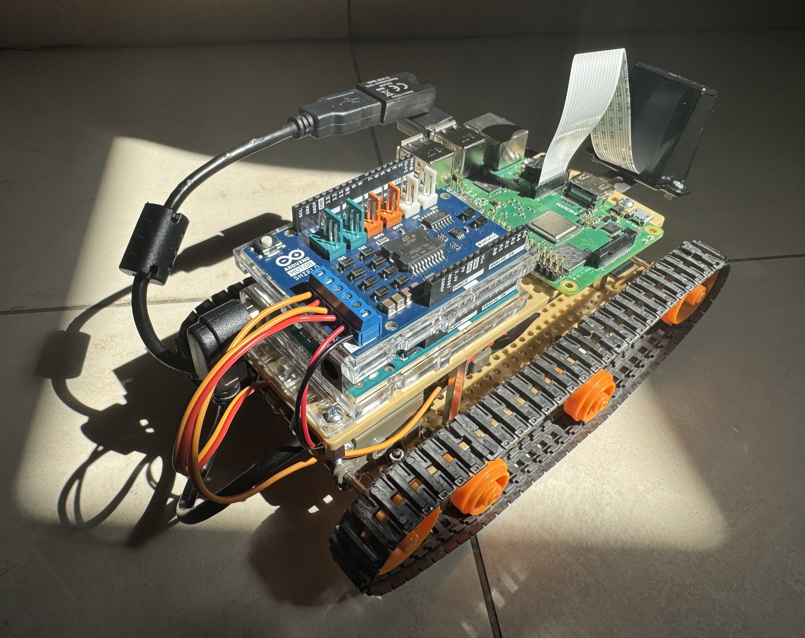
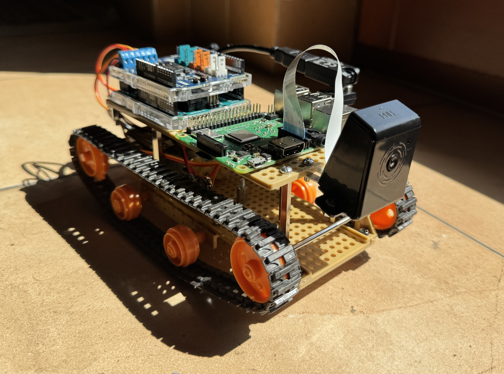
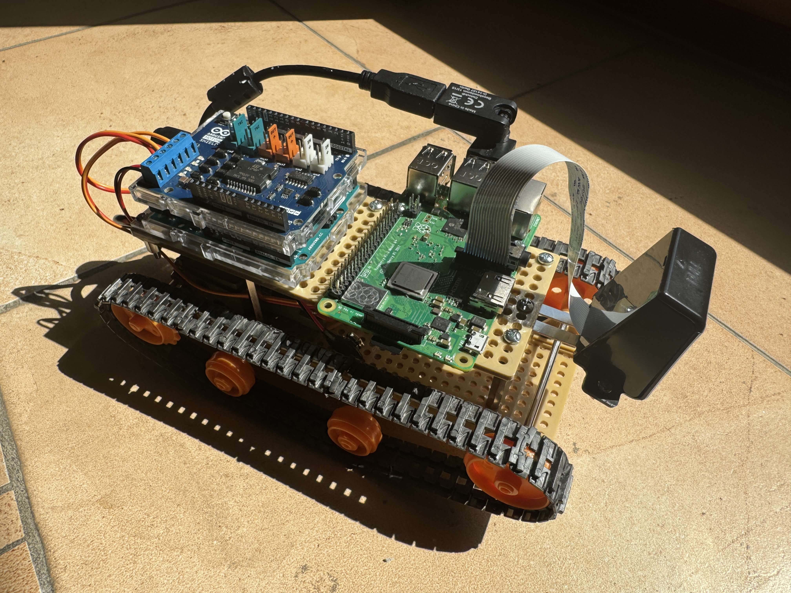
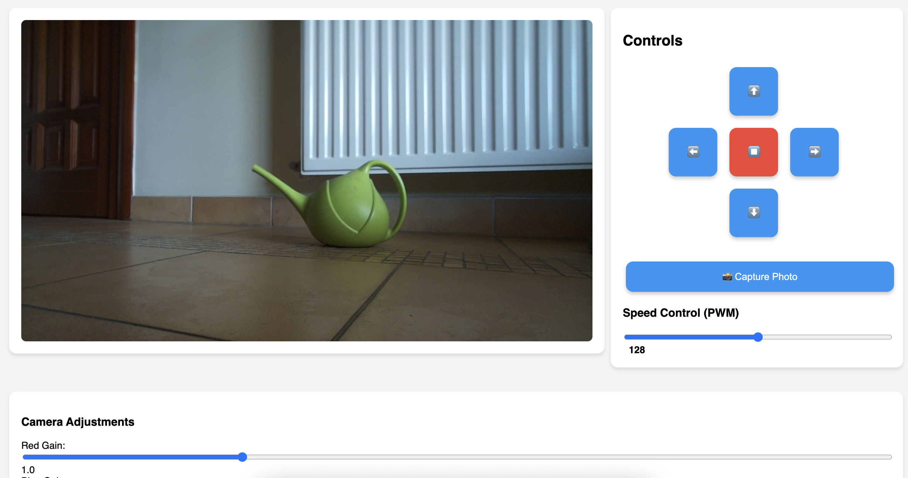

# Raspberry Pi Robot: Motor Control & Camera Streaming

## Overview

This project enables remote control and live video streaming for a robot powered by a **Raspberry Pi 3B+** and an **Arduino Uno** with a motor shield. The system provides a web interface for controlling the robot's movement, adjusting camera settings, and viewing a real-time video feed.

---

## Hardware Used

- **Raspberry Pi 3B+**
- **Arduino Uno** (connected via USB to the Pi)
- **L298N Motor Shield** (or compatible)
- **Camera** (compatible with Pi, e.g., Pi Camera v2)
- **Robot chassis, motors, and power supply**

---

## Features

- **Web-based control panel** for robot movement (forward, backward, left, right, stop)
- **PWM speed control** for motors
- **Live video streaming** from the Pi camera
- **Camera adjustments** (red/blue gain, contrast, sharpness)
- **Photo capture and download**
- **Serial connection monitoring** (disables controls if Arduino is disconnected)
- **Hotspot setup** for direct WiFi connection to the Pi

---

## Images

### Robot Views

| Back | Front | Side | Web Controls |
|------|-------|------|--------------|
|  |  |  |  |

---

## Setup Instructions

### 1. Prepare the Raspberry Pi

- Install Raspberry Pi OS (Lite or Desktop).
- Connect the Pi Camera and enable it (`sudo raspi-config`).
- Connect the Arduino Uno via USB.

### 2. Set Up the Hotspot (Optional)

To create a WiFi hotspot on the Pi for direct connection:

```sh
bash setup-hotspot.sh
```

This script uses `network-manager` to create a hotspot named **MyPiHotspot** with password `123456789`.

### 3. Install and Run the Control & Streaming Server

Run the following script to set up the web server and dependencies:

```sh
bash setup-stream-and-control-server.sh
```

This script will:

- Create the project directory and necessary files.
- Install required Python packages (`flask`, `picamera2`, `opencv`, `pyserial`).
- Set up a systemd service to auto-start the server on boot.
- Deploy a Flask web app for robot control and video streaming.

After setup, access the web interface at:

```
http://<raspberry-pi-ip>:5000
```

---

## Arduino Sketch

The Arduino sketch ([arduino-sketch-h-bridge.cpp](arduino-sketch-h-bridge.cpp)) listens for serial commands from the Pi and controls the motors accordingly. Supported commands:

- `forward`, `backward`, `left`, `right`, `stop`
- `pwm:<value>` (set speed, 0–255)

---

## Conclusions

This project demonstrates a simple yet powerful way to combine a Raspberry Pi and Arduino for robotics, enabling real-time control and video streaming over WiFi. The modular design allows for easy customization and extension.

---

## Credits

This project was written with the help of **ChatGPT**.

---